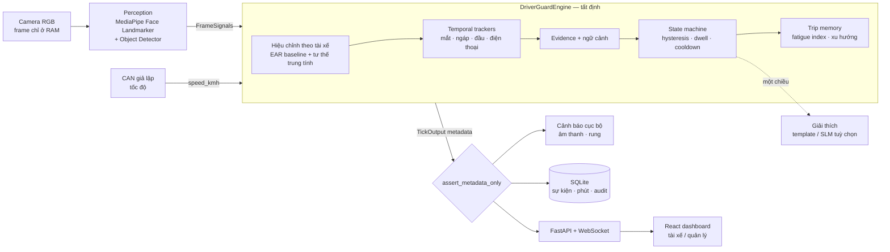

# 01 — Kiến trúc DriverGuard (skeleton v0.1)

**DriverGuard = Reliable Signals + Temporal Evidence + Deterministic Safety Logic.**
Mô hình học máy mạnh nằm ở tầng nhận thức; quyết định cảnh báo nằm ở máy trạng thái tất định, audit được.

## Luồng dữ liệu



Hai ranh giới quan trọng:

1. **Ảnh không bao giờ đi qua `FrameSignals`.** Sau perception chỉ còn số. Mọi đầu ra (API, WebSocket, SQLite,
   JSONL) đi qua `privacy.assert_metadata_only`. Xem trước camera chỉ có trong cửa sổ OpenCV cục bộ (`--show`).
2. **Giải thích là một chiều.** `explain(level, reasons) -> text`. Văn bản (kể cả từ SLM/LLM sau này) không bao
   giờ được đưa ngược vào để đổi `risk_level`, ngưỡng hay cảnh báo.

## Bản đồ module

| Module | Trách nhiệm | Test |
|---|---|---|
| `capture/` | Webcam / video → frame + timestamp (ms). Báo mất camera tường minh | `test_capture_perception` |
| `perception/` | Frame → `FrameSignals`: EAR trái/phải, MAR, blendshape, yaw/pitch/roll, chất lượng mặt, điện thoại. **Không có trạng thái thời gian** | `test_geometry`, `test_capture_perception` |
| `calibration/` | Baseline EAR cá nhân (thích ứng / cố định) + tư thế trung tính | `test_calibration` |
| `temporal/` | Cửa sổ thời gian có trọng số, debounce, hysteresis; tracker mắt/ngáp/đầu/điện thoại | `test_temporal` |
| `risk/` | Ngữ cảnh chuyến, evidence → ứng viên mức, state machine, chính sách cảnh báo | `test_risk_engine`, `test_golden` |
| `trip/` | Gom theo phút, fatigue index, độ dốc Theil–Sen | `test_config_context_trip` |
| `vehicle/` | CAN giả lập (mã hoá/giải mã frame tốc độ), replay CSV | `test_config_context_trip` |
| `engine.py` | Ghép tất cả: `FrameSignals → TickOutput` (thuần, không camera) | tất cả |
| `pipeline.py` | Nguồn → perception → engine → sinks; đo FPS/độ trễ | — |
| `storage/` | SQLite metadata: trips, events (+ phản hồi tài xế), minute_stats, config_audit | `test_privacy_storage_auth` |
| `api/` | FastAPI, 2 vai trò, WebSocket, HITL `/config` | `test_api` |
| `evaluation/` | Ghép sự kiện, false alerts/giờ, chia theo người, nhãn khoảng + kappa, operating curve, UTA-RLDD, benchmark | `test_evaluation` |
| `sim/` | Kịch bản tổng hợp (không cần camera/model) — **chỉ để kiểm tra logic, không phải kết quả** | — |

## Luật quyết định (giá trị mặc định = seed, tune trên validation)

| Mức | Luật | Loại |
|---|---|---|
| CRITICAL | Nhắm mắt liên tục ≥ `eye.microsleep_ms` (2000 ms) và xe không dừng | tức thời |
| WARNING | Nhắm ≥ `eye.long_closure_ms` (1000 ms) · nhìn lệch/cúi ≥ `head.distraction_ms` (2500 ms) · điện thoại gần mặt ≥ 1,5 s · gật đầu khi PERCLOS-proxy đã cao · PERCLOS-proxy ≥ 0,25 · điểm ≥ 60 | tức thời / bền ≥ 1,5 s |
| CAUTION | PERCLOS-proxy ≥ 0,15 · ≥ 2 lần ngáp / 5 phút · ≥ 2 lần gật / 5 phút · lái ≥ 4 h · xu hướng mệt tăng · điểm ≥ 35 | bền ≥ 1,5 s |
| SENSOR_DEGRADED | Mặt không hợp lệ / mất camera liên tục ≥ 3 s. Trước 3 s: **giữ mức cũ** | — |

- **Hạ mức**: mục tiêu thấp hơn liên tục ≥ `risk.min_dwell_ms` (3 s) **và** điểm < ngưỡng thoát (hysteresis).
- **Ngữ cảnh**: 1–5 h sáng, 13–15 h, hoặc lái ≥ 4 h → mọi ngưỡng × 0,85 (nhạy hơn). Xe dừng → không cảnh báo nhắm mắt / điện thoại / nhìn lệch.
- **Cảnh báo lặp**: WARNING+ nhắc lại sau `risk.alert_cooldown_ms` (20 s), hoặc sau 5 s nếu có lý do mới.
- Điện thoại đơn lẻ không bao giờ tạo CRITICAL.

## Hợp đồng dữ liệu

- `FrameSignals` (`schemas.py`) — một frame; đây là định dạng parquet do Kaggle notebook ghi ra.
- `TickOutput` (`schemas.py`) — một tick; khớp mục "Output contract" trong tài liệu nghiên cứu, thêm
  `perclos_proxy`, `ear_norm`, `calibrated`, `fatigue_index/trend`, `drive_time_min`, `speed_kmh`.

## API

| Method | Path | Quyền |
|---|---|---|
| GET | `/health` | công khai (không có dữ liệu tài xế) |
| POST | `/auth/login` | — |
| GET | `/state` · WS `/ws/stream?token=` | tài xế: chỉ xe của mình · quản lý: tất cả |
| GET | `/events` · POST `/events/{id}/feedback` | tài xế: của mình |
| GET | `/trips`, `/trips/current/summary`, `/trips/{id}/minutes` | tài xế: của mình |
| GET / POST | `/config` | POST chỉ `fleet_manager`, có audit |

Không tồn tại (và có test đảm bảo): `/face.jpg`, `/upload_video`, stream camera.

## Kiểm thử quyền riêng tư (GĐ3, bắt buộc trước khi báo cáo)

1. Chạy `driverguard serve --source 0` 30 phút, mở dashboard từ máy khác.
2. Bắt gói tin (Wireshark / `tcpdump -w`) trên cổng 8000.
3. Tìm chữ ký ảnh trong payload: JPEG `FF D8 FF`, PNG `89 50 4E 47`, chuỗi base64 dài. Kỳ vọng **0 byte ảnh**.
4. Kiểm tra `data/runtime/*.db` và thư mục làm việc không có file ảnh/video.

## Chạy

```bash
driverguard simulate --scenario drowsy                     # không cần camera / model
driverguard run --source 0 --show                          # webcam + preview cục bộ
driverguard serve --source synthetic:demo                  # API + dashboard (demo)
driverguard serve --source 0                               # API + dashboard (webcam)
driverguard extract --video v.mp4 --out data/features/v.parquet
driverguard replay --features data/features/v.parquet --set calibration.method=fixed
```
