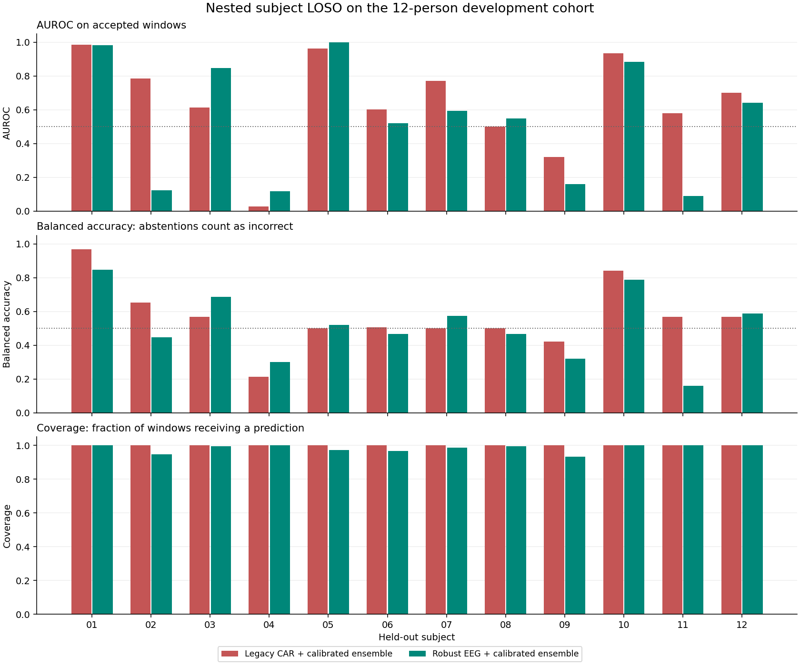

# Kết quả mô hình EEG v3.1

Ngày: 2026-10-01. Đã xuất checkpoint, CSV dự đoán ngoài tập huấn luyện,
báo cáo metrics và kiểm thử suy luận. **Chưa chứng minh được model mới tốt
hơn baseline về khả năng tổng quát; không chọn robust làm model cảnh báo.**

## Quy Trình

Giữ nguyên dữ liệu gốc, features cũ và checkpoint v2. Cohort gồm 12 người,
24 bản ghi, 1.800 cửa sổ không chồng lấn, mỗi cửa sổ 4 giây. Nhãn fatigue
được kế thừa từ trạng thái thí nghiệm của cả bản ghi.

Hai phương án dùng cùng 150 đặc trưng công suất tương đối và cùng grid ba
ứng viên: LDA shrinkage `auto`, Logistic C=0,1 và Logistic C=1. Mỗi model là
ensemble ba thành viên; mỗi thành viên fit classifier/scaler và calibration
trên các nhóm người tách biệt. Calibration dùng raw decision margin và sigmoid
đơn điệu. Ngưỡng quyết định luôn là 0,5.

Nested LOSO có 12 lượt ngoài. Trong mỗi lượt, người được kiểm tra không có mặt
trong quá trình chuẩn hóa, fit, hiệu chỉnh hoặc chọn cấu hình. Lựa chọn nội bộ
tối thiểu hóa log loss trung bình theo người. Khoảng tin cậy dùng 1.000 lượt
bootstrap toàn bộ người; không bootstrap ngẫu nhiên từng cửa sổ.

Checkpoint triển khai được chọn bằng LOSO nội bộ trên toàn cohort trước khi
xem báo cáo các lượt ngoài, rồi fit từ toàn cohort. Nó không có tập test độc
lập của riêng mình. Các metrics dưới đây dùng CSV dự đoán của từng lượt ngoài,
không dùng dự đoán của checkpoint trên dữ liệu đã train.

## Kết Quả Chính

Các giá trị là trung bình giữa 12 người, không phải metrics gộp cửa sổ.

| Chỉ số | CAR cũ + calibration mới | EEG robust + calibration mới |
|---|---:|---:|
| AUROC | 0,6494 | 0,5426 |
| Khoảng tin cậy AUROC 95% | 0,4874–0,7868 | 0,3485–0,7271 |
| AUPRC | 0,6851 | 0,6171 |
| Balanced accuracy, cửa sổ đạt chất lượng | 0,5667 | 0,5251 |
| Balanced accuracy, abstention tính là sai | 0,5667 | 0,5133 |
| Macro F1 | 0,4887 | 0,4606 |
| Sensitivity | 0,5800 | 0,5690 |
| Specificity | 0,5533 | 0,4812 |
| Log loss, thấp hơn tốt hơn | 0,7026 | 0,7513 |
| Brier score, thấp hơn tốt hơn | 0,2538 | 0,2730 |
| Coverage | 100% | 98,28% |

Chênh lệch AUROC robust trừ tham chiếu là −0,1068; CI ghép cặp 95% là
−0,2589 đến 0,0193. Chênh lệch balanced accuracy có tính abstention là
−0,0533; CI −0,1361 đến 0,0211. Ước lượng điểm thấp hơn, nhưng CI rộng và
cắt qua 0; chưa kết luận được khác biệt thống kê chắc chắn.

Robust giữ đủ timestamps của 1.800 cửa sổ, chấp nhận 1.769 và từ chối 31.
Coverage normal là 898/900 = 99,78%; fatigue là 871/900 = 96,78%. Vì từ chối
không cân bằng giữa hai lớp, phải báo cáo cả accepted-only và coverage-adjusted.
Đạt kiểm tra artifact tự động không đồng nghĩa với EEG đã được chuyên gia xác
nhận sạch. Nội suy cũng không phục hồi được thông tin sinh lý đã mất.

Kết quả test 8/2/2 trước đây của v2 là AUROC 0,6464 và balanced accuracy 0,5000.
Protocol khác với nested LOSO ở đây, nên không trừ trực tiếp hai số để tuyên bố
mức cải thiện. Cả hai phương án v3.1 vẫn có CI AUROC bao gồm 0,5. Log loss và
Brier cũng chưa tốt hơn mốc dự đoán hằng 0,5 trên tập cân bằng.

## Lỗi Đã Sửa Và Thử Nghiệm Không Đạt

Bản v3 đầu tiên biến decision margin thành xác suất rồi cắt xác suất trước khi
lấy logit để calibration. Kiểm tra riêng 8 người train ban đầu cho thấy 40,56%
điểm LDA vượt biên ±13,8, làm mất thứ tự nhiều cửa sổ. Đã sửa bằng calibration
trực tiếp raw margin, giữ tương thích với checkpoint cũ. Kiểm thử dùng margin
40/80 xác nhận các điểm bị bão hòa trước đây nay vẫn có thể phân biệt.

Không đổi grid, ba nhóm calibration hoặc ngưỡng 0,5. Trên train-only LOSO,
sửa lỗi nâng AUROC LDA 0,7378 lên 0,7562, balanced accuracy 0,6391 lên 0,6514.
Trên toàn cohort, robust v3 trước sửa có AUROC 0,5019 và BA 0,4678; v3.1 có
0,5426 và 0,5251. Đây là chuỗi thử nghiệm phát triển thích nghi trên cùng cohort,
không phải một test độc lập mới.

Đã thử tham chiếu cá nhân bằng 60 giây EEG tỉnh đầu tiên trên 8 người train,
loại các cửa sổ tham chiếu khỏi huấn luyện/chấm điểm. AUROC và log loss đều xấu
đi so với không cá nhân hóa, nên không đưa cách này vào model. LOGO calibration
cải thiện xếp hạng trên train-only nhưng chưa cải thiện BA nhất quán; chưa đổi
protocol chính theo kết quả các lượt ngoài.

## Artifacts Và Sử Dụng

- `models/eeg_vigilance_v3_1/legacy_model.pt`: ensemble LDA đã calibration,
  dùng features `fatigue_eeg` cũ.
- `models/eeg_vigilance_v3_1/model.pt`: ensemble Logistic C=1 đã calibration,
  dùng features `fatigue_eeg_robust_v1` và quality gate.
- `legacy_nested_loso_predictions.csv`, `robust_nested_loso_predictions.csv`:
  dữ liệu để viết metrics; giữ cả abstention và chỉ số cửa sổ gốc.
- `summary.json`, hai JSON nested LOSO, `protocol.json`, manifest và selection:
  metrics, khoảng tin cậy, dữ liệu/source hashes và audit chia người.
- [Metrics lưu trên Git](results/v3_1/eeg_v3_development.json),
  [hướng dẫn chạy](08_model_v3_usage.md).

Suy luận trực tiếp CNT và từ NPZ cho kết quả giống hệt trên bản ghi subject 06
fatigue, gồm 75 cửa sổ với 5 abstention. Checkpoint export tái tạo đúng score của
model trong bộ nhớ trên toàn bộ 24 bản ghi. Các model/features lớn được Git ignore;
code, báo cáo tóm tắt và biểu đồ được lưu phiên bản.

## Quyết Định Nghiên Cứu

Có thể dùng checkpoint và CSV để test pipeline, viết metrics và nghiên cứu lỗi.
Chưa dùng kết quả này làm bằng chứng model đủ tin cậy cho cảnh báo thực tế.
Ưu tiên tiếp theo là EEG có người tham gia đa dạng hơn, annotation chi tiết hơn,
montage rõ ràng và cohort kiểm chứng độc lập. Thay đổi representation, chẳng hạn
covariance với thư viện Riemannian hoặc temporal EEG encoder, cần một protocol
mới đóng băng trước đánh giá. Camera–EEG fusion cần dữ liệu hai tín hiệu đồng bộ,
không ghép giả các bản ghi không cùng người/thời điểm. Agents và IoT chưa triển khai.
