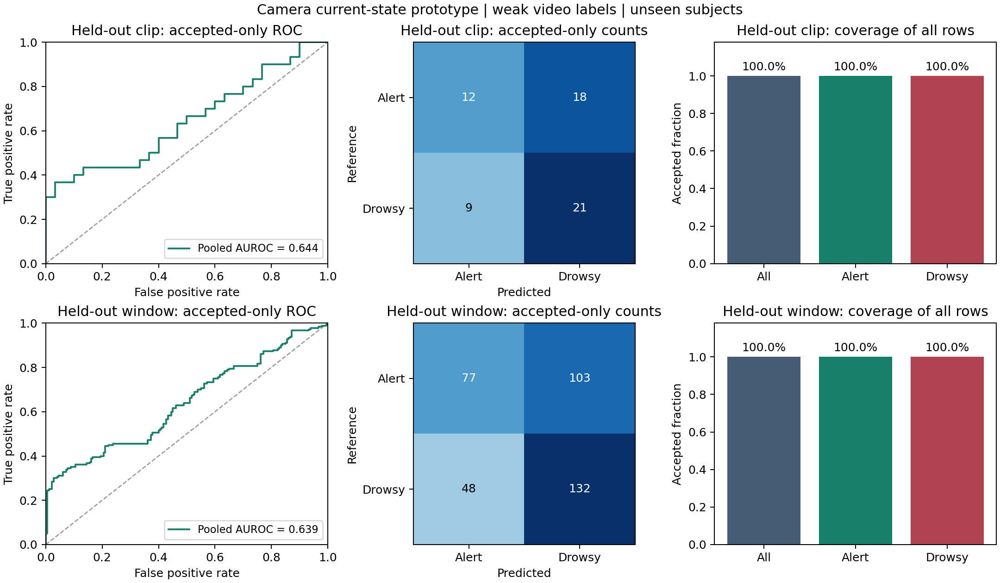

# Kết quả camera v1 và bước tiếp theo

Ngày: 01/10/2026. Đã có checkpoint camera-only để chạy webcam/video và xuất
score phục vụ viết metrics. Chất lượng hiện tại còn thấp; chưa đạt mô hình
cuối cảnh báo sớm bằng giám sát EEG hoặc khả năng vận hành ban đêm đã kiểm chứng.

## Dữ liệu và huấn luyện

Dùng bản [UTA-RLDD crop khuôn mặt trên Kaggle](https://www.kaggle.com/datasets/mathiasviborg/uta-rldd-videos-cropped-by-faces):
59 người, 354 clip 10 giây, 224×224, 10 FPS; mỗi người có ba clip tỉnh và ba
clip buồn ngủ ở các vị trí thời gian phân bố trong video nguồn. Subject 42 bị
loại vì thiếu lớp buồn ngủ. Tập này có nhãn theo video, chưa có nhãn từng sự
kiện hay onset EEG. Mirror khai báo CC BY-NC-SA 4.0; khi sử dụng cần kiểm tra
điều kiện nguồn và trích dẫn [UTA-RLDD](https://arxiv.org/abs/1904.07312).
Video và feature không được phân phối lại qua Git.

Chia theo người: 39 train, 10 validation, 10 test trước augmentation/trích
cửa sổ. Train thêm exposure 0,6, tổng 588 biến thể và 58.800 frame; raw-valid
fraction toàn corpus biến thể là 98,29%. Validation/test giữ ánh sáng nguồn.
Manifest và cache được kiểm tra hash; chạy xác minh lại corpus hoàn tất giữ
manifest bất biến. Dữ liệu đủ để kiểm tra pipeline nghiên cứu, chưa đủ để
xác nhận cảnh báo thực tế, cảnh báo sớm hoặc độ chính xác ban đêm.

MediaPipe Face Landmarker nhận diện điểm mắt, mũi, miệng và tư thế đầu. GRU
hidden size 32 học chuỗi 50 mẫu quá khứ ở 10 Hz, với chín giá trị hình học/
blendshape, chín mask khả dụng và một mask mặt hợp lệ. Không dùng độ sáng
làm đặc trưng dự đoán buồn ngủ. Ảnh gốc quyết định cổng chất lượng; tăng sáng
gamma/CLAHE chỉ hỗ trợ nhận diện landmark. Cửa sổ cần ít nhất 60% mẫu hợp lệ
và frame cuối hợp lệ. Không đủ dữ liệu trả `cannot_assess`, score `null`.

Chọn epoch bằng validation log loss có trọng số theo người/lớp/clip/cửa sổ;
epoch tốt nhất là 2, early stopping kết thúc ở epoch 9. Ngưỡng 0,45 được
chọn bằng balanced accuracy trên cửa sổ validation có cùng cách cân trọng số.
Score chưa được calibration. Checkpoint khoảng 24,8 KB, chưa tính asset
MediaPipe và thư viện runtime.

## Kết quả test đóng băng

Test có 10 người chưa thấy khi train, 60 clip cân bằng hai lớp. Clip score là
trung bình cửa sổ hợp lệ của cả clip để đánh giá offline; không phải một
cảnh báo online. Không dùng test chọn epoch, ngưỡng hoặc điều chỉnh model v1.

| Metric | Clip | Cửa sổ |
|---|---:|---:|
| AUROC pooled | 0,6444 | 0,6392 |
| Balanced accuracy | 0,5500 | 0,5806 |
| Macro-F1 | 0,5396 | 0,5705 |
| Recall | 0,7000 | 0,7333 |
| Specificity | 0,4000 | 0,4278 |
| Coverage | 100% | 100% |

Coverage cửa sổ chỉ tính các thời điểm đã đủ 50 mẫu lịch sử, không gồm
warmup. Subject-macro AUROC clip là 0,7222. CI 95% của AUROC pooled clip
là 0,5277–0,7756, bootstrap cả người test 300 lần, seed 42; độ bất định còn
lớn do chỉ có 10 người test.

Confusion matrix clip, hàng là nhãn thật tỉnh/buồn ngủ, cột là dự đoán
tỉnh/buồn ngủ: `[[12, 18], [9, 21]]`. Như vậy 18/30 clip tỉnh bị phân loại
thành buồn ngủ ở ngưỡng hiện tại. Đây là false positive theo clip, chưa phải
false alerts mỗi giờ vì cảnh báo còn có persistence và hysteresis.

Báo cáo máy đọc được ở [summary.json](results/camera_v1/summary.json).
Artifacts cục bộ: `models/camera_drowsiness_v1/model.pt`, `metrics.json`,
`predictions.csv`, `clip_predictions.csv`. Hướng dẫn chạy và tái tạo:
[11_camera_model_usage.md](11_camera_model_usage.md).

## Kiểm tra runtime và thiếu sáng

Đã chạy headless trên clip test `02/0/02_0_0_00.mp4`, 100 frame 224×224 ở
10 FPS. Có 51 score từ mốc 4.900 ms; cả 51 khớp suy luận offline với sai
khác tuyệt đối lớn nhất bằng 0. P50 xử lý 37,17 ms và P95 47,33 ms.
Phạm vi phép đo là perception + GRU + luật; không bao gồm capture, queue,
âm thanh cảnh báo hoặc preview. Chưa đo webcam thật hay FPS toàn hệ thống.
Log nằm ở `outputs/camera_v1_video_smoke.jsonl`.

Đã kiểm tra thêm hai nhánh runtime bằng video FFV1 30 FPS tạo từ việc lặp
mỗi frame nguồn ba lần, xác minh pixel giải mã không đổi. CLI xử lý 299/300
frame do bộ lấy mẫu hiện có bỏ timestamp 33 ms; 51 bin có score từ 4.900
đến 9.900 ms vẫn khớp tuyệt đối offline. Log nằm ở
`outputs/camera_v1_30hz_smoke.jsonl`. Phép thử này xác nhận tách cadence
tracking của model và luật trên nguồn nhân tạo, chưa chứng minh tốc độ
webcam hoặc độ chính xác trên video 30 FPS thật.

Tiền xử lý thiếu sáng đã qua kiểm tra MediaPipe trên ảnh làm tối nhân tạo:
ảnh đen/phẳng không bị coi là thông tin mặt đáng tin cậy; quality đo trên
ảnh gốc. Đây là kiểm tra chức năng, chưa phải accuracy trên tài xế ban đêm.
Trong cabin tối hoàn toàn cần camera NIR/nguồn IR và kiểm chứng landmark,
kính phản xạ, quality và model trên dữ liệu NIR thật.

Bộ kiểm thử toàn dự án chạy thành công sau sửa lỗi timestamp/cadence;
Ruff đạt trên các module/test thay đổi. Hash checkpoint và manifest dữ liệu
giữ nguyên sau kiểm tra suy luận và sửa runtime.

## Hướng cải thiện đã xác định

Ưu tiên tiếp tục phần model; Agents và IoT theo sau. Cần mở rộng video liên
tục và nhãn sự kiện, dữ liệu thiếu sáng thật và cohort độc lập. Chọn mọi
thay đổi bằng train/validation; kết quả test v1 đã được xem nên cần cohort
test mới để xác nhận công bằng các phiên bản tiếp theo.

Video tham chiếu cục bộ của người dùng kết hợp EEG từ nhiều nguồn và các
đường mô phỏng, không cung cấp cặp camera–EEG train đồng bộ. Chưa có dữ liệu
cùng người/cùng phiên để fine-tune EEG supervision một cách hợp lệ. EEG
checkpoint riêng trong repo không tự trở thành đáp án onset của camera.

Đóng góp nghiên cứu dự kiến: nhánh nhanh phản ứng với nhắm mắt nguy hiểm,
nhánh temporal chậm học nguy cơ onset từ camera qua EEG supervision, kèm
mask chất lượng ánh sáng. Cần camera ít nhất 30 FPS để nghiên cứu động học
mở lại mí mắt; bộ 10 FPS hiện tại chưa đủ cho kết luận này. Fine-tune từ
camera v1 bằng nhãn onset/teacher EEG đã kiểm chứng, rồi đánh giá lead time
và sensitivity ở cùng false alerts/giờ; student cuối chỉ nhận camera.
Tính mới và lợi ích phải được kiểm tra bằng tổng quan tài liệu và ablation.
